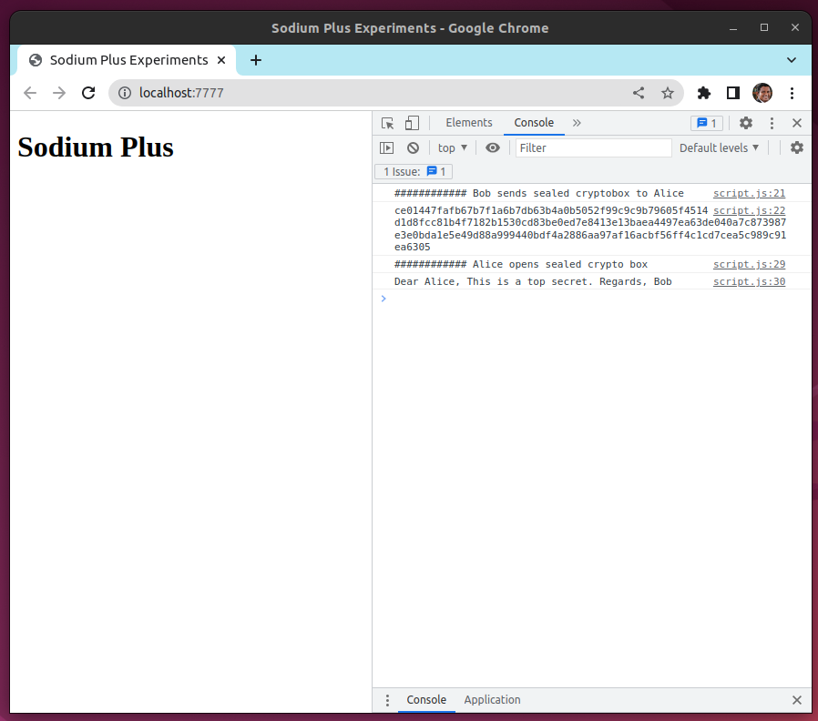
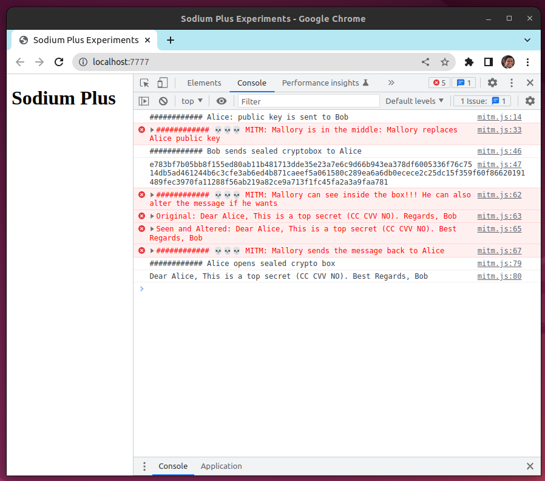
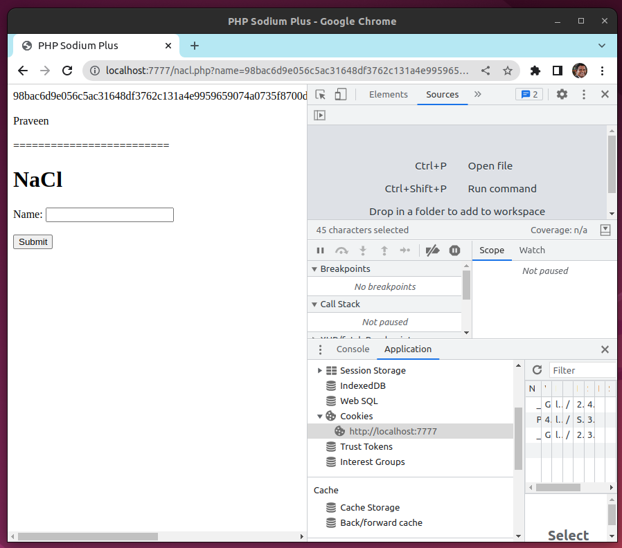

# Sodium Plus

https://github.com/paragonie/sodium-plus

## Developer-friendly libsodium interface

# Man in the Middle Attack (MITM)

https://en.wikipedia.org/wiki/Man-in-the-middle_attack

## Demo

☠️☠️☠️ Man in the JavaScript (MITJS) 💀💀💀

See: mitm.js

# PHP Sodium

See: nacl.php

https://www.php.net/manual/en/ref.sodium.php

